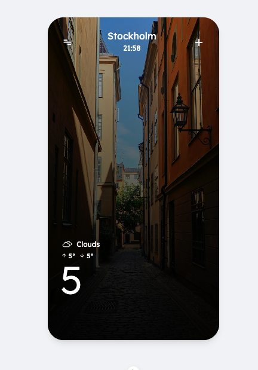

# Weather App

Nuxt 4 application with Vue 3, Vite, and TailwindCSS.
Based on Yahoo Weather



## Features

- **Nuxt 4 + Vue 3** with Vite for fast dev experience
- **TailwindCSS** for utility-first styling
- [**Unsplash integration**](https://unsplash.com/developers)
- [**OpenWeather API**](https://openweathermap.org/api)
- **TypeScript** support for type safety
- **Prettier & ESLint** for code style and linting

---

## API Keys

This app requires **Unsplash** API keys to fetch the images based on city search.

### Unsplash API Key
- Go to [Unsplash Developers](https://unsplash.com/developers)
- Register a new app and copy the **Access Key**
- This will be used to fetch fallback background images when no album art is found

---

## Environment Variables

Create a `.env` file in the root of your project and add:

```env
# Spotify API
SPOTIFY_CLIENT_ID=your_spotify_client_id
SPOTIFY_CLIENT_SECRET=your_spotify_client_secret

# Unsplash API
UNSPLASH_ACCESS_KEY=your_unsplash_access_key
```

After creating or updating `.env`, restart the development server.

---

## Installation

```bash
# npm
npm install

# yarn
yarn install

# bun
bun install
```

---

## Development Server

Start the development server on `http://localhost:3000`:

```bash
# npm
npm run dev

# yarn
yarn dev

# bun
bun run dev
```

---

## Production

Build the application for production:

```bash
# npm
npm run build

# yarn
yarn build

# bun
bun run build
```

Locally preview production build:

```bash
# npm
npm run preview

# yarn
yarn preview

# bun
bun run preview
```

---

## 🎧 Usage

- The app will fetch the weather based on user query
- Images based on city search are fetched using Unsplash API
- localStorage used to keep track of queries and images
